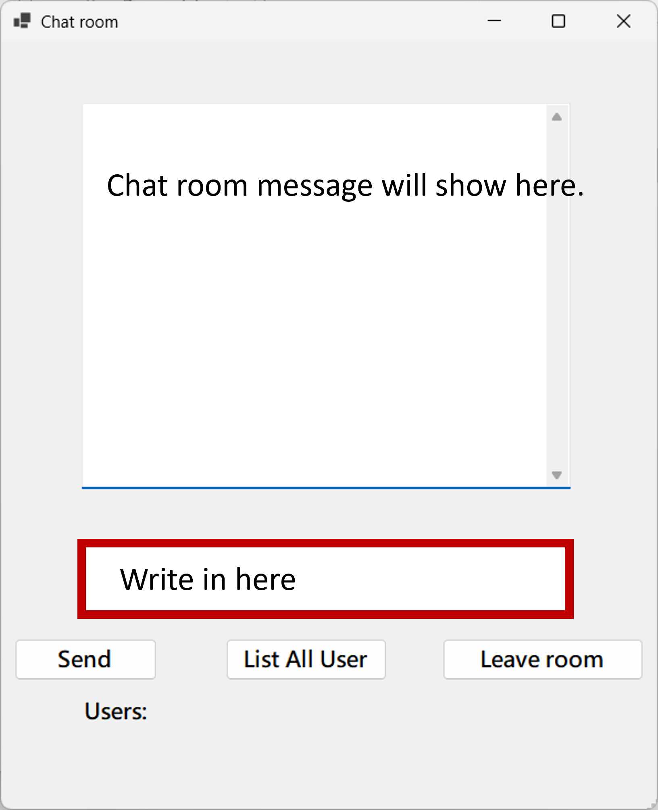

# ChatRoomClient
Chat room client in C#.   
Must be run under Windows operating system.  
Executable file path:  
ChatRoomClient\ChatRoomClient\bin\Debug\net8.0-windows\ChatRoomClient.exe  
Follow the button instructions to execute the function.  
Need to connect to server, log in, then can enter the chat room.
Then you can send message as follow:

 
